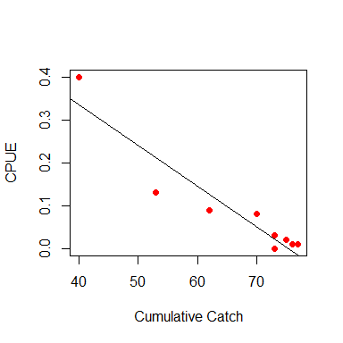

Eradication progress app user guide
-----------------------------------

This shiny app is primarily to be used for assessing progress towards
eradication of a pest population. As an eradication program progresses,
and additional data become available, the app will provide updates on
the estimate of the residual size of the pest population remaining or
the residual proportion of occupied sites. This help file provides some
guidance about the use of the app including the types of monitoring data
as well as the associated models that can be used to undertake an
eradication progress. Before using this app, the practitioner should
ideally be familiar with the material in the accompanying document
`Quantitative decision support for eradication - a primer`. In
particular, the practitioner should have read
`Spatial considerations: Extent, Management Zones and Sampling Units`
and `Assessing Progress`.

This user guide also makes use of the example data provided in the
accompanying ZIP file. Eventually, the app will be able to automatically
load these examples directly but for now, please unzip these files into
a convenient location.

### Assessing progress

Consideration of the primary removal method is of great importance
because the data collected from this method will be used to generate
population estimates. For valid estimates to be obtained, the primary
removal method must be able to remove individuals at a rate faster than
they can be replaced. This can be easily visualised using a cumulative
catch curve, which plots the cumulative catch (removals) of individuals
against the catch per unit effort (CPUE) (Figure 1). The negative of the
slope of this relationship is an estimate of the detection rate (also
known as the catchability coefficient). If a clear negative relationship
is not evident or there is evidence of a flattening of the relationship
(non-linearity), then that suggests that the population might not be
reducing at a rate high enough to achieve eradication or that the
detection rate of individuals is declining. If this occurs, then
alternative removal techniques need to be used. One problem with relying
on the cumulative catch versus CPUE plot is that the relationship may
suggest that all individuals have been removed, when in fact,
eradication has not been achieved. This occurs because the relationship
in Figure 1 assumes that detectability is constant for the duration of
removal activities when in fact, the residual population is no longer
susceptible to the removal method, (e.g. they may be trap-shy and
therefore never get caught, resulting in detectability declining to
zero). Identifying this situation depends on the use of a monitoring
protocol running in parallel with the primary removal method that is
able to detect residual survivors (e.g. cameras or scat-detecting dogs).

Figure 1. Plot of the relationship between CPUE and cumulative catch

### Models

The models in the eradication progress app are based on closed
population removal estimators. This means that the models require data
on the total catch of individuals of the pest species removed, at each
sampling location, for each of `J` periods (or “sessions”). Here a
period refers to a distinct period of time where removal of the pest is
actively occurring. For example, rodent trapping might be undertaken
over four consecutive nights, once a month for five months. Hence, there
are five periods or sessions with each period consisting of four nights
trapping. Data from at least three periods are required for use in the
models used here. These models also assume that the population is closed
for the duration of the eradication program. In the example above this
would mean that the rodent population is not subject to births,
immigration, emigration or natural mortality over the five periods so
the only change to the population is due to the removals. Alternative
models that relax this assumption and allow for recruitment and natural
losses to the population in addition to the removals are in the
pipeline. The following models are currently available in the app.

-   `remGP`
    -   This model implements the catch-effort model of Gould & Pollock
        (1996). It is an aspatial model which means that removals are
        aggregated over all removal devices for each period. This means
        that device locations and habitat information are not used or
        required for this model. The catch and effort data are assembled
        from the removal histories by summing removals from each device,
        separately for each period. Effort data is calculated as the
        number of devices set in each period.
-   `remMN`
    -   This model implements the multinomial removal model of Haines
        (2018). Unlike remGP, device locations are required for this
        model and habitat information can be used to model spatial
        variation in initial abundance. Device locations are assumed to
        be independent
-   `remGRM`
    -   This model estimates the generalised removal model of Dorazio et
        al. (2005). However, it also has the facility to include
        additional monitoring data into the analysis in addition to the
        removal data. The additional monitoring data are assumed to be
        derived from monitoring devices set in the same general vicinity
        (or a subset thereof) as the removal devices. Hence, the
        additional monitoring data should have the same number of rows
        and columns as the removal data and are uploaded into the app
        using `detection histories` button. Removal devices without an
        associated monitoring device should hav an `NA` inserted for the
        appropriate row in `detection histories`.

### Inputs

All models in the progress app require inputs in particular formats

-   `Region boundary`
    -   The shapefiles that define the region of interest. Select all
        files (`.shp`, `.shp`, `.dbf`, `.prj` ) as a group. Shapefies
        should be projected, rather than in geographic format.
-   `Habitat raster`
    -   A `.tif` file(s) containing a map of habitat variable(s) that
        could be used predict spatially-varying abundance across the
        region. Multiple `.tif` files can be selected.
-   `Trap locations`
    -   A `.csv` file containing coordinates of `M` removal devices in
        the same projection as `region boundary`. The first column
        should be the easting (x) coordinate and the second the northing
        (y).
-   `Removal histories`
    -   A `.csv` file containing a `M` x `J` matrix of removals for each
        of `M` removal device in rows and `J` periods for each device in
        columns.
-   `Detection histories`
    -   A `.csv` file containing a `M` x `J` matrix of detections or
        counts for monitoring devices set in the same general locations
        as the removal devices. Removal devices without an associated
        monitoring device should have an `NA` inserted in the
        appropriate row in `detection histories`.

Analysis
--------

Once the data for a particular model has been uploaded, pressing the
`fit model` button will run the selected model and print the output in
the “fitted model” pane. Outputs include the parameter estimates and a
prediction of both the initial population size within the region based
on the monitored sites as well as an estimate of the residual population
size follwoing the last removal period. Any habitat covariates uploaded
previously should also be available and can be selected in the model if
desired. The `Estimate density surface` button displays a map of the
predicted initial density across the region.

### References

Dorazio, R. M., Jelks, H. L., & Jordan, F. (2005). Improving
Removal-Based Estimates of Abundance by Sampling a Population of
Spatially Distinct Subpopulations. Biometrics, 61(4), 1093–1101.

Gould, W. R., & Pollock, K. H. (1997). Catch-effort maximum likelihood
estimation of important population parameters. Canadian Journal of
Fisheries and Aquatic Sciences, 54, 890–897.

Haines, L. M. (2019). Multinomial N-mixture models for removal sampling.
Biometrics, September, 1–9. <https://doi.org/10.1111/biom.13147>
